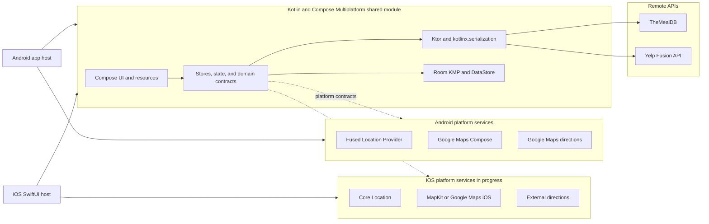
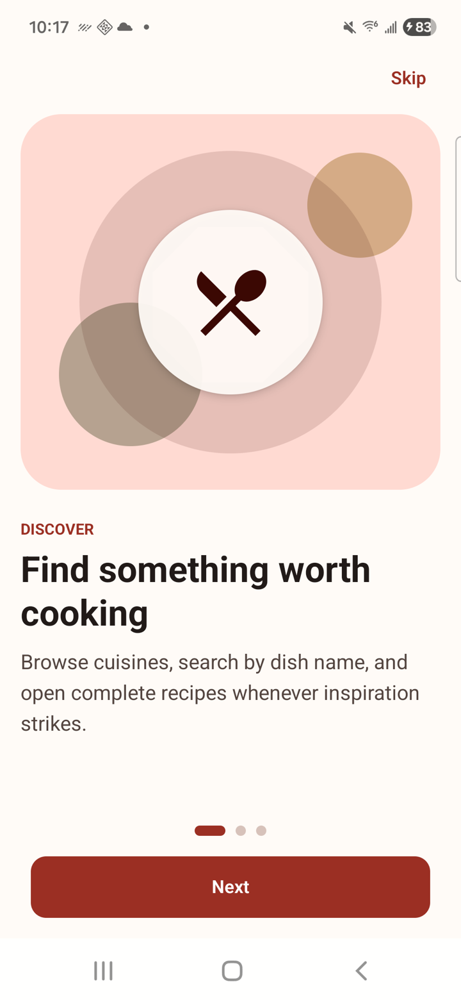
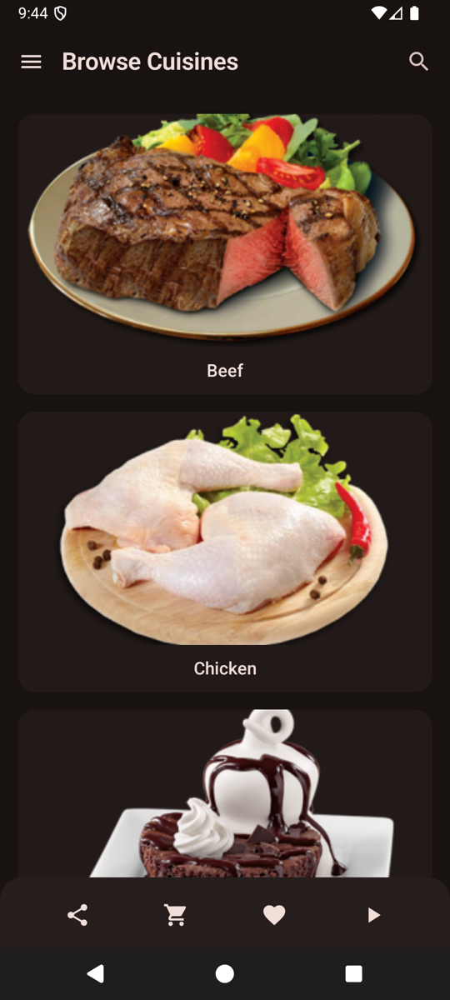
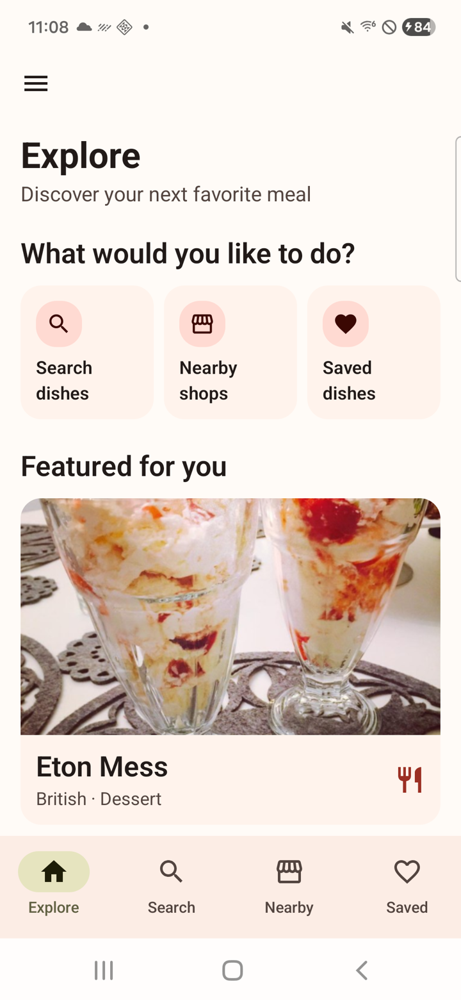
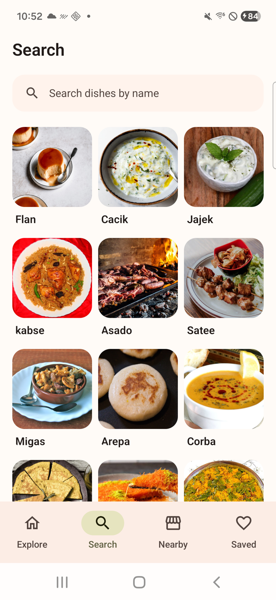
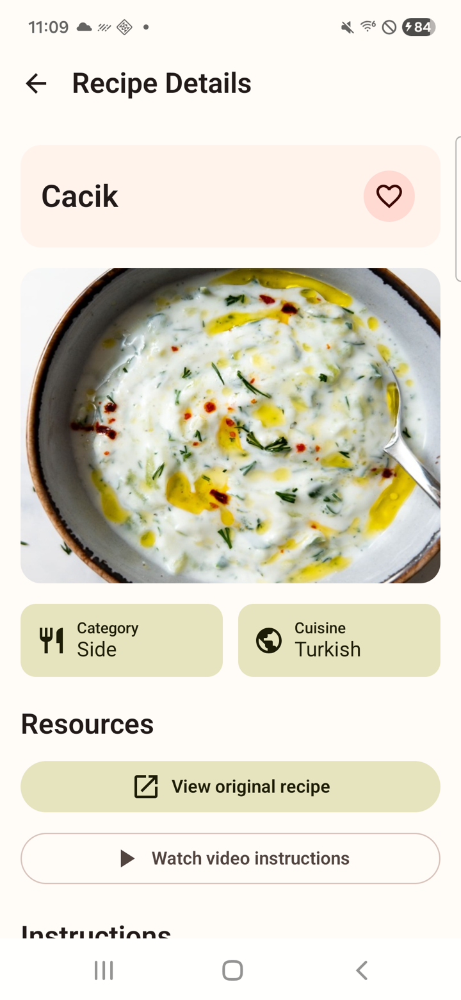
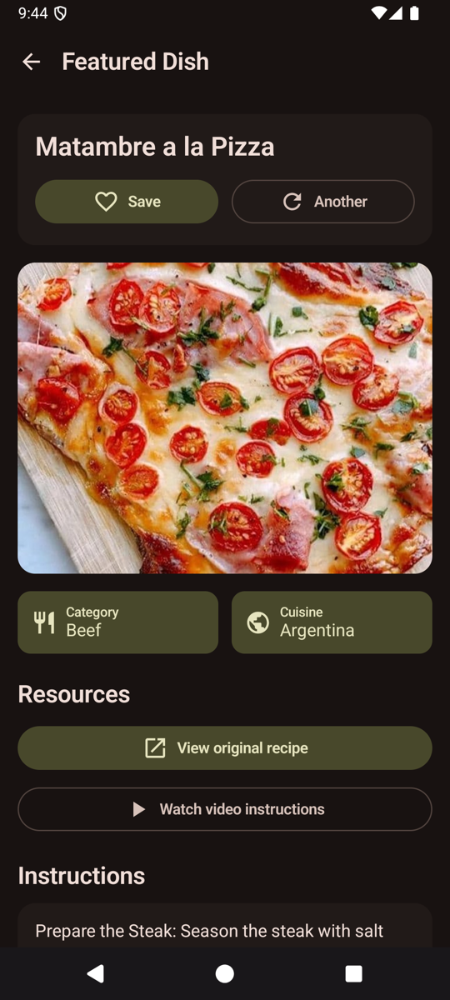
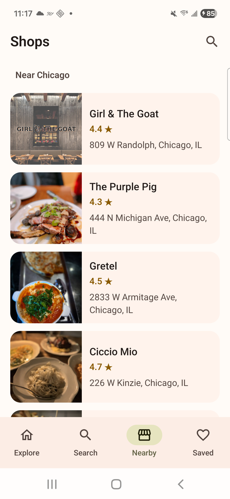
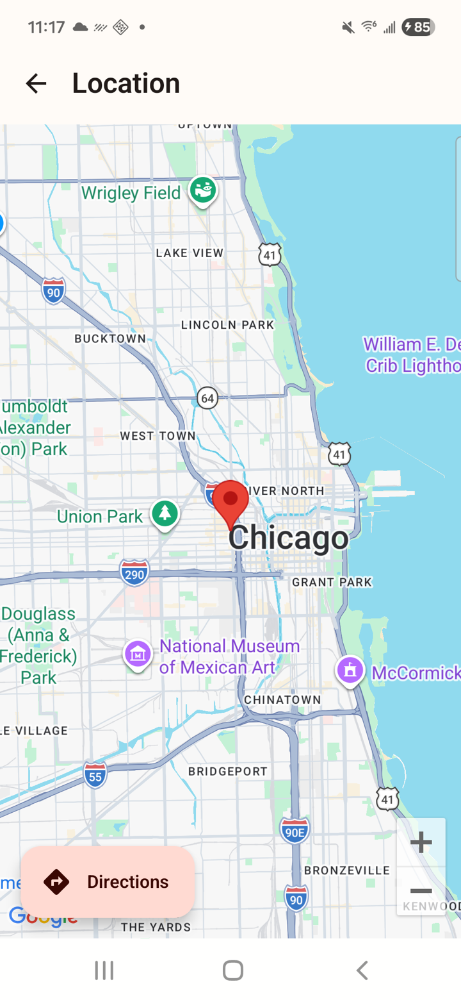
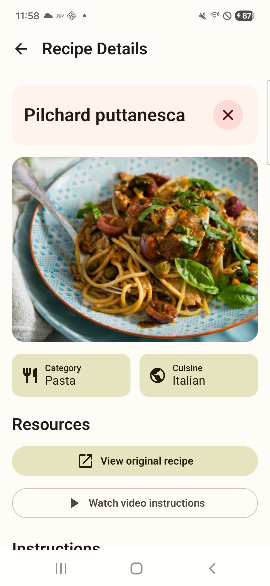

# Recipe Compose

Recipe Compose is a portfolio mobile application originally built to learn Jetpack Compose and later redesigned into a fuller product sample. It connects recipe discovery with restaurant search and real-world navigation: users can explore meals from TheMealDB, save recipes locally, find restaurants through Yelp, inspect a destination on an interactive map, and continue into driving directions.

The project now demonstrates incremental Compose Multiplatform migration as well as modern Compose development across state-driven UI, Ktor networking, Room persistence, navigation, responsive layouts, and platform services. Shared onboarding, discovery, search, recipe details, saved dishes, theming, networking, and persistence run on Android and iOS. Android remains the complete product baseline while native iOS location, maps, and directions are migrated behind platform contracts.

## Product capabilities

- Learn the core discovery, saving, and restaurant features through a focused first-run onboarding flow.
- Move between recipe discovery, search, nearby restaurants, and saved dishes from a persistent navigation bar.
- Browse recipe categories or use a compact, image-first search to find dishes by name.
- Open a complete recipe details page, follow its original source or video, and save the dish locally.
- Open saved dishes as full recipe details, remove an individual dish with confirmation, or use swipe-to-delete for quick list management.
- Discover Yelp restaurants after explicitly choosing the device's current location, remember that choice for later visits, or enter a city or ZIP code instead.
- Search the loaded area by restaurant name or cuisine.
- View a selected restaurant on an interactive Google Map.
- Reposition the destination marker and launch driving directions to the active pin.
- Respond to loading, error, and network-connectivity states.

## Engineering highlights

- Declarative, state-driven screens built entirely with Jetpack Compose and Material 3.
- Unidirectional UI state exposed from ViewModels through `StateFlow`.
- Lifecycle-aware Flow collection that avoids observing inactive screens.
- Explicit UI events for retries, searches, refreshes, dialogs, favorites, and navigation.
- Debounced remote search with cancellation to prevent outdated requests from controlling the UI.
- Shared Ktor clients with `kotlinx.serialization` and Ktor `MockEngine` contract tests.
- Navigation Compose routes with state passed between destinations.
- Reusable Compose components for dialogs, media cards, links, lists, and application chrome.
- A shared recipe-details page reused by Featured Dish, search results, and saved-dish destinations.
- A debug-only screen preview catalog with representative data and paired light/dark renders.
- Purpose-built editorial feeds, adaptive galleries, and compact management lists for different content types.
- A semantic Material 3 design system with coordinated light/dark palettes, typography, spacing, and shapes.
- Local-first favorites with Room KMP, platform-specific database construction, and swipe-to-delete interactions.
- Preferences DataStore for non-blocking onboarding state and retained location intent.
- External navigation handoff that follows the currently selected map marker.
- Foreground-only location access with support for approximate and precise permission.
- User-initiated permission requests, cache-first location resolution, a bounded fresh-location attempt, and manual search fallbacks.
- Build-time credential injection, redacted authorization headers, and debug-only HTTP body logging.
- Companion documentation for the UI redesign, Gradle Kotlin DSL migration, KMP assessment, and Compose Multiplatform migration path.

## Restaurant navigation

The restaurant workflow turns the user's current area into an actionable destination:

```text
User chooses current location or enters an area
        ↓
Foreground permission when needed (approximate or precise)
        ↓
Nearby Yelp restaurant discovery
        ↓
Restaurant selection
        ↓
Interactive map and destination marker
        ↓
Optional marker adjustment
        ↓
Google Maps driving directions
```

Location access is requested only after the user chooses **Use my location**. After a successful resolution, Preferences DataStore remembers that choice so later Nearby visits can resolve the current area automatically. Android remains the source of truth for the actual permission grant: if access is revoked, the app returns to its permission/manual fallback instead of treating the stored preference as authorization. The app first accepts a recent coordinate and otherwise performs a bounded fresh-location request, so it cannot remain on a location spinner indefinitely. If access is declined or coordinates are unavailable, the Nearby screen remains usable through a city or ZIP code search. Exact coordinates and location history are never persisted, and the app does not request background location.

The directions action uses either the restaurant marker or the user-adjusted marker as its destination. Google Maps manages the route origin and its own navigation permissions after the handoff.

## Architecture

The repository keeps installable Android and iOS hosts around a Kotlin Multiplatform `:shared` library. Common code owns portable UI, state, repositories, networking, resources, and persistence contracts. Platform source sets and hosts supply lifecycle integration, storage paths, permissions, location, maps, and external navigation.



Contributor rule of thumb: place portable UI and route behavior in `shared/src/commonMain/.../presentation`, keep platform-independent contracts and state models under `domain`, and put Ktor/Room implementations under `data`. Android- or iOS-specific permissions, location, maps, storage paths, and external actions belong in their platform source sets or host applications and are wired through Koin.

## Technology

| Area | Implementation |
| --- | --- |
| User interface | Compose Multiplatform, Jetpack Compose, Material 3 |
| State and lifecycle | Shared stores, ViewModel adapters, StateFlow, lifecycle-aware collection |
| Navigation | Navigation Compose and a shared iOS application shell |
| Networking | Ktor Client, OkHttp/Darwin engines, kotlinx.serialization |
| Local persistence | Room KMP, Preferences DataStore |
| Recipe data | TheMealDB API |
| Restaurant discovery | Yelp Fusion API |
| Location and mapping | Fused Location Provider, Google Maps Compose, Google Maps directions handoff |
| Dependency injection | Koin |
| Build tooling | Kotlin Multiplatform, Kotlin DSL, version catalogs, KSP, Secrets Gradle Plugin, Xcode |

## Project setup

### Prerequisites

- Android Studio and a compatible Android SDK.
- A Google Maps Platform API key with Maps SDK for Android enabled.
- A Yelp Fusion API key.

### Installation

1. Clone the repository:

   ```bash
   git clone git@github.com:GetRighhttt/RecipeCompose.git
   cd RecipeCompose
   ```

2. Add the following values to the root `local.properties` file:

   ```properties
   MAPS_API_KEY=your_google_maps_key
   YELP_API_KEY=your_yelp_fusion_key
   YELP_BASE_URL=https://api.yelp.com/v3/
   BASE_URL=https://www.themealdb.com/api/json/v1/1/
   ```

   `local.properties` is excluded from version control. The checked-in `local.defaults.properties` supplies non-sensitive defaults for project synchronization and keyless CI builds.

3. Build the debug application:

   ```bash
   ./gradlew :app:assembleDebug
   ```

4. Run the `app` configuration on an Android device or emulator with Google APIs.

On the first Nearby visit, choose **Use my location** and grant approximate or precise foreground access to load local restaurants. The permission prompt is user initiated and can be declined without blocking the feature; enter a city or ZIP code instead. A successful device-location choice is remembered for later visits, and **Choose another location** resets that behavior.

## Credential handling

The Secrets Gradle Plugin exposes local configuration through generated `BuildConfig` values and Android manifest placeholders while keeping real credentials out of source control.

This protects the repository, not the compiled APK. For an appropriate deployment configuration:

- Restrict the Maps key to the application ID and signing-certificate fingerprint.
- Use separate development and production credentials.
- Keep real credentials out of `local.defaults.properties`.
- Route Yelp requests through a backend service if the credential must remain confidential.

## Verification

Run the primary local checks with:

```bash
./gradlew :app:testDebugUnitTest :app:lintDebug
```

Additional engineering notes are tracked in [`docs/`](docs), including the [cleanup audit](docs/CODE_CLEANUP_AUDIT.md), [retained location preference implementation](docs/LOCATION_PREFERENCE_PLAN.md), [theme and UI redesign](docs/THEME_AND_UI_REDESIGN.md), [Gradle Kotlin DSL migration notes](docs/GRADLE_KOTLIN_DSL_MIGRATION.md), [KMP migration assessment](docs/KMP_MIGRATION_ASSESSMENT.md), and [Compose Multiplatform migration plan](docs/COMPOSE_MULTIPLATFORM_MIGRATION_PLAN.md).

For visual iteration, open `app/src/debug/java/com/example/recipe_app_compose/preview/ScreenPreviews.kt` with the Debug build variant selected. Android Studio can render the main screens in light and dark mode without launching the app. Shared fixtures live beside it in `PreviewData.kt` and are excluded from release builds.

## Screenshots

<table>
  <tr>
    <td align="center">
      
      <br />
      <sub><strong>First-run onboarding</strong></sub>
    </td>
    <td align="center">
      
      <br />
      <sub><strong>Browse cuisines</strong></sub>
    </td>
    <td align="center">
      
      <br />
      <sub><strong>Explore and discover</strong></sub>
    </td>
  </tr>
  <tr>
    <td align="center">
      
      <br />
      <sub><strong>Search dishes</strong></sub>
    </td>
    <td align="center">
      
      <br />
      <sub><strong>Recipe details and saving</strong></sub>
    </td>
    <td align="center">
      
      <br />
      <sub><strong>Featured dish discovery</strong></sub>
    </td>
  </tr>
  <tr>
    <td align="center">
      
      <br />
      <sub><strong>Nearby restaurant discovery</strong></sub>
    </td>
    <td align="center">
      
      <br />
      <sub><strong>Map and driving directions</strong></sub>
    </td>
    <td align="center">
      
      <br />
      <sub><strong>Saved-dish management</strong></sub>
    </td>
  </tr>
</table>

## Contributing

1. Fork the repository and create a focused branch.
2. Implement and test the change.
3. Run the verification commands above.
4. Open a pull request describing the user-facing behavior and implementation details.

## Contact

Questions and feedback are welcome at **stefanbusiness95@gmail.com**.
